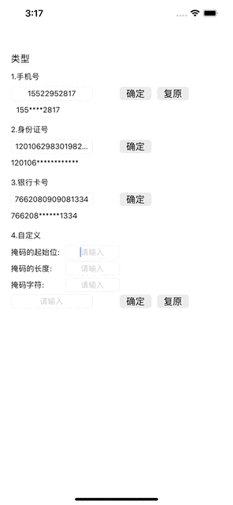
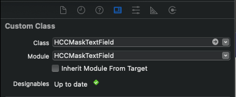

### [README of Chinese](./README_CN.md)

# HCCMaskTextField

 
 
 
 
 

## About

This is a textField to add a mask for mobile phone number, ID number, bank card number.
You can also customize the location, length, and type of the mask.

## Effect Picture




## Example

To run the example project, clone the repo, and run `pod install` from the Example directory first.

## Release notes
### 1.0.0

- [x] Add a mask to your phone number, ID number, bank card number.
- [x] User can customize the location, length, and mask characters.


## Documentation 
### Requirements

iOS 9.0+

swift 5+

### Installation

HCCMaskTextField is available through [GitLab](https://github.com/hccxc/ios-mask-text-field.git). To install
it, simply add the following line to your Podfile:

```ruby
pod 'HCCMaskTextField' , :git => 'https://github.com/hccxc/ios-mask-text-field.git'
```

### Basic Usage
#### XIB Initialization

```swift
    // MARK: ViewController Initial Config
    override func viewDidLoad() {
        super.viewDidLoad()
        // Initialize the textfield type
        phoneNumberTextField.initialConfig(.phone, self)
        idNumberTextField.initialConfig(.idCard, self)
        cardNumberTextField.initialConfig(.bankCard, self)
        customTextField.initialConfig(.custom(0, 0, "*"), self)
    }
```
#### ViewController lazy load HCCMaskTextField

```swift
    // MARK: ViewController lazy load HCCMaskTextField
    lazy var maskTextField: HCCMaskTextField = {
        let maskTF = HCCMaskTextField(frame: CGRect(x: 20, y: 700, width: 250, height: 25))
        // Initialize the textfield type
        maskTF.initialConfig(.phone, self)
        maskTF.borderStyle = UITextBorderStyle.roundedRect
        maskTF.clearButtonMode = .whileEditing
        return maskTF
    }()
    
    override func viewDidLoad() {
        super.viewDidLoad()
        self.view.addSubview(maskTextField)
    }
```
