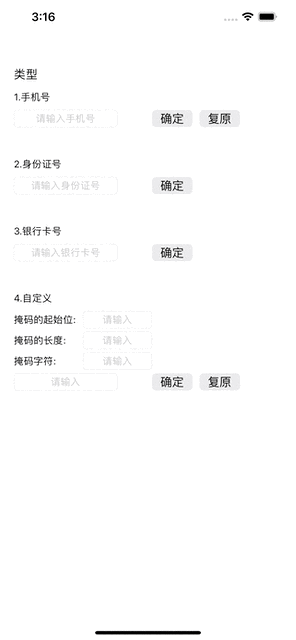
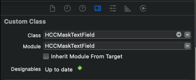

### [英文README](./README.md)

# HCCMaskTextField

 
 
 
 
 

## 项目介绍

这是一个为手机号 身份证号 银行卡号 添加掩码的输入框.
还可以自定义添加掩码起始位置 掩码长度 掩码类型.

## 效果图




## 下载demo

克隆项目到本地，在example目录运行' pod install '后，直接运行项目

## 版本说明
### 1.0.0

- [x] 为手机号 身份证号 银行卡号 添加掩码
- [x] 自定义添加掩码起始位置 掩码长度 掩码类型


## 技术文档 
### 环境需求

iOS 9.0+

swift 5+

### 安装

HCCMaskTextField 可以通过 [GitLab](https://github.com/hccxc/ios-mask-text-field.git)安装。
将下面的代码添加到你的Podfile:

```ruby
pod 'HCCMaskTextField' , :git => 'https://github.com/hccxc/ios-mask-text-field.git'
```

### 基本用法
#### XIB 初始化控件

```swift
    // MARK: XIB 初始化控件 初始化配置
    override func viewDidLoad() {
        super.viewDidLoad()
        // MARK: 初始化配置
        phoneNumberTextField.initialConfig(.phone, self)
        idNumberTextField.initialConfig(.idCard, self)
        cardNumberTextField.initialConfig(.bankCard, self)
        customTextField.initialConfig(.custom(0, 0, "*"), self)
    }
```
#### 在控制器中懒加载控件

```swift
    // MARK: 在控制器中懒加载控件
    lazy var maskTextField: HCCMaskTextField = {
        let maskTF = HCCMaskTextField(frame: CGRect(x: 20, y: 700, width: 250, height: 25))
        // MARK: 初始化配置
        maskTF.initialConfig(.phone, self)
        maskTF.borderStyle = UITextBorderStyle.roundedRect
        maskTF.clearButtonMode = .whileEditing
        return maskTF
    }()
    
    override func viewDidLoad() {
        super.viewDidLoad()
        self.view.addSubview(maskTextField)
    }
```
